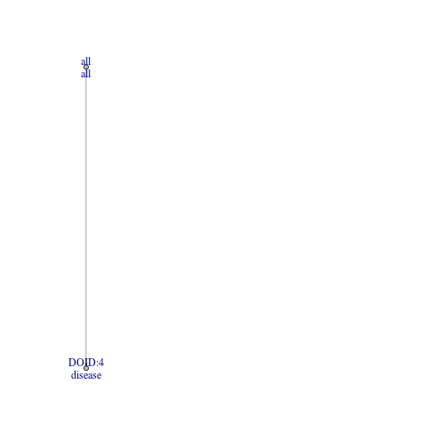

  
# Overview
oGraph is a package for ontology representation and visualization. 

# Quick start guide
This section describes a simple working session using **oGraph**. 

A typical session can be divided into two steps:
  
1.  *Data preparation* build the oGraph object which has the ontology store in an underlying igraph object.

2.  *Running analysis* treeview, subtree, find parent/child terms...


Here are example vignettes:


```r
library('ograph')
```

```
## ograph loaded.
## These ontology package(s) are currently available in your libPath:
## GOCC HDO HPO NiGOBP NiGO
```

```r
ograph::initOGraph('HDO')
```


```r
ontGraph<-new("ontGraph",ontology='HDO')
print(ontGraph)
```

```
## 
## ------------------------- ontGraph object -------------------------
## 
##  Ontology:
##    -  HDO 
## 
##  Graph:
## IGRAPH DN-- 6549 6904 -- 
## attr: name (v/c), def (v/c), description (v/c), level (v/n),
##   is_leaf (v/l), color (v/c), type (e/c)
## 
##  levels:
```

```
##             Length Class  Mode   
## nodes2level 6549   -none- list   
## level2nodes   14   -none- list   
## noOfLevels     1   -none- numeric
## noOfNodes      1   -none- numeric
```

```r
g=ontGraph@graph
root=findRoot(graph=g)
leaves=findLeafNode(graph=g)
treeplot(g,label=0)
```

 

```r
nodes=shortest_path_to_root(graph=g,node='DOID:10652')
g2=set.node.attribute(g,attr_name='color',attr_value='red',nodes=nodes)
treeplot(g2,label=0)
```

 
</center>


```r
subg<-subGraphByLevel(graph=g,l=3)
treeplot(subg,label=1)
```

 
  

```r
terms=c('DOID:10652','DOID:14330')
list.vertex.attributes(graph=g)
```

```
## [1] "name"        "def"         "description" "level"       "is_leaf"    
## [6] "color"
```

```r
get.node.attribute(g,attr='def',nodes=terms)
```

```
## [1] "Alzheimer's disease" "Parkinson's disease"
```

```r
subg<-subGraphByNodes(graph=g,nodes=terms)
treeplot(subg,label=1)
```

 


```r
subg=mapGene2Graph(graph=subg,file=system.file("extdata","human_gene2HDO_o", package ="ograph"))
treeplot(subg,label=1,show.genes=TRUE)
```

 


```r
term='DOID:150'
get.node.attribute(g,attr='def',nodes=term)
```

```
## [1] "disease of mental health"
```

```r
peekNode(g,node=term)
```

```
## name:DOID:10652
## 
## def:Alzheimer's disease
## 
## description:"A dementia and a tauopathy that results in progressive memory loss, impaired thinking, disorientation, and changes in personality and mood starting and leads in advanced cases to a profound decline in cognitive and physical functioning and is marked histologically by the degeneration of brain neurons especially in the cerebral cortex and by the presence of neurofibrillary tangles and plaques containing beta-amyloid. It is characterized by memory lapses, confusion, emotional instability and progressive loss of mental ability." [ls:IEDB, url:http\://en.wikipedia.org/wiki/Alzheimer%27s_disease, url:http\://www.merriam-webster.com/medical/alzheimer%27s%20disease, url:http\://www.nia.nih.gov/alzheimers/publication/alzheimers-disease-fact-sheet]
## 
## level:8
## 
## is_leaf:TRUE
## 
## color:grey
```

```r
findParentNodes(graph=g,node=term)
```

```
## [1] "DOID:4"
```

```r
findChildrenNodes(graph=g,node=term)
```

```
##  [1] "DOID:0060037" "DOID:0060043" "DOID:10935"   "DOID:10937"  
##  [5] "DOID:1234"    "DOID:1510"    "DOID:1561"    "DOID:1766"   
##  [9] "DOID:303"     "DOID:4737"    "DOID:507"     "DOID:535"
```

```r
cs=findAllChildrenNodes(g,term)
g.cs=subGraphByNodes(graph=g,nodes=cs,include_path_to_root=TRUE)
treeplot(g.cs,label=0)
```

 

```r
ps=findAllParentNodes(g,term)
g.ps=subGraphByNodes(graph=g,nodes=ps,include_path_to_root=TRUE)
treeplot(g.ps,label=1)
```

 


```r
clip_neuro=searchDescription4Keyword(graph=g,keys=c('neuro'))
names=searchName4Keyword(g,keys=c('neuro'))
get.node.attribute(g,attr='def',names)
```

```
##   [1] "parenchymatous neurosyphilis"                                         
##   [2] "meningovascular neurosyphilis"                                        
##   [3] "hereditary sensory neuropathy"                                        
##   [4] "distal hereditary motor neuropathy"                                   
##   [5] "gastrointestinal neuroendocrine tumor"                                
##   [6] "alcohol-related neurodevelopmental disorder"                          
##   [7] "neuroacanthocytosis"                                                  
##   [8] "familial encephalopathy with neuroserpin inclusion bodies"            
##   [9] "arteritic anterior ischemic optic neuropathy"                         
##  [10] "non-arteritic anterior ischemic optic neuropathy"                     
##  [11] "large cell neuroendocrine carcinoma"                                  
##  [12] "small cell neuroendocrine carcinoma"                                  
##  [13] "small intestine carcinoid neuroendocrine tumor"                       
##  [14] "cervical neuroblastoma"                                               
##  [15] "retroperitoneal neuroblastoma"                                        
##  [16] "peripheral neuropathy"                                                
##  [17] "autonomic peripheral neuropathy"                                      
##  [18] "central nervous system primitive neuroectodermal neoplasm"            
##  [19] "survival motor neuron spinal muscular atrophy"                        
##  [20] "asymptomatic neurosyphilis"                                           
##  [21] "neuroretinitis"                                                       
##  [22] "idiopathic progressive polyneuropathy"                                
##  [23] "mediastinum neuroblastoma"                                            
##  [24] "mediastinum ganglioneuroblastoma"                                     
##  [25] "nasal cavity olfactory neuroblastoma"                                 
##  [26] "idiopathic peripheral autonomic neuropathy"                           
##  [27] "diabetic autonomic neuropathy"                                        
##  [28] "autonomic neuropathy"                                                 
##  [29] "neurocirculatory asthenia"                                            
##  [30] "tibial neuropathy"                                                    
##  [31] "mononeuropathy"                                                       
##  [32] "ischemic neuropathy"                                                  
##  [33] "anterior ischemic optic neuropathy"                                   
##  [34] "mediastinum neurofibroma"                                             
##  [35] "nutritional optic neuropathy"                                         
##  [36] "neurotrophic keratoconjunctivitis"                                    
##  [37] "neurogenic bladder"                                                   
##  [38] "radial neuropathy"                                                    
##  [39] "neurohypophyseal diabetes insipidus"                                  
##  [40] "vestibular neuronitis"                                                
##  [41] "acoustic neuroma"                                                     
##  [42] "diabetic polyneuropathy"                                              
##  [43] "neurodegenerative disease"                                            
##  [44] "toxic optic neuropathy"                                               
##  [45] "neurogenic bowel"                                                     
##  [46] "neuroaspergillosis"                                                   
##  [47] "polyneuropathy in collagen vascular disease"                          
##  [48] "neuroschistosomiasis"                                                 
##  [49] "neurofibroma of spinal cord"                                          
##  [50] "polyneuropathy"                                                       
##  [51] "algoneurodystrophy"                                                   
##  [52] "central neurocytoma"                                                  
##  [53] "alcoholic neuropathy"                                                 
##  [54] "polyneuropathy due to drug"                                           
##  [55] "neurogenic arthropathy"                                               
##  [56] "critical illness polyneuropathy"                                      
##  [57] "neuroleptic malignant syndrome"                                       
##  [58] "neuronal ceroid lipofuscinosis"                                       
##  [59] "melanotic neuroectodermal tumor"                                      
##  [60] "neuroendocrine tumor"                                                 
##  [61] "neuroectodermal tumor"                                                
##  [62] "neuroendocrine carcinoma"                                             
##  [63] "neuroma"                                                              
##  [64] "motor neuron disease"                                                 
##  [65] "neuroaxonal dystrophy"                                                
##  [66] "cutaneous ganglioneuroma"                                             
##  [67] "motor peripheral neuropathy"                                          
##  [68] "sensory peripheral neuropathy"                                        
##  [69] "inflammatory and toxic neuropathy"                                    
##  [70] "dysembryoplastic neuroepithelial tumor"                               
##  [71] "prostate neuroendocrine neoplasm"                                     
##  [72] "ovary neuroendocrine neoplasm"                                        
##  [73] "breast neuroendocrine neoplasm"                                       
##  [74] "high pressure neurological syndrome"                                  
##  [75] "neurodermatitis"                                                      
##  [76] "peripheral primitive neuroectodermal tumor"                           
##  [77] "neurofibrosarcoma"                                                    
##  [78] "olfactory neuroblastoma"                                              
##  [79] "brachial plexus neuropathy"                                           
##  [80] "extracranial neuroblastoma"                                           
##  [81] "adult central nervous system primitive neuroectodermal neoplasm"      
##  [82] "childhood central nervous system primitive neuroectodermal neoplasm"  
##  [83] "pantothenate kinase-associated neurodegeneration"                     
##  [84] "colon neuroendocrine neoplasm"                                        
##  [85] "intestinal neuroendocrine benign tumor"                               
##  [86] "gastrointestinal neuroendocrine benign tumor"                         
##  [87] "differentiating neuroblastoma"                                        
##  [88] "ganglioneuroblastoma"                                                 
##  [89] "cerebral neuroblastoma"                                               
##  [90] "femoral neuropathy"                                                   
##  [91] "peroneal neuropathy"                                                  
##  [92] "polyradiculoneuropathy"                                               
##  [93] "bone peripheral neuroepithelioma"                                     
##  [94] "soft tissue peripheral neuroepithelioma"                              
##  [95] "neuromuscular junction disease"                                       
##  [96] "neuromuscular disease"                                                
##  [97] "small intestine neuroendocrine neoplasm"                              
##  [98] "ovarian large-cell neuroendocrine carcinoma"                          
##  [99] "ulnar neuropathy"                                                     
## [100] "uremic neuropathy"                                                    
## [101] "childhood mediastinal neurogenic tumor"                               
## [102] "malignant mediastinal neurogenic neoplasm"                            
## [103] "gastric neuroendocrine neoplasm"                                      
## [104] "cerebellopontine angle primitive neuroectodermal"                     
## [105] "intracranial primitive neuroectodermal tumor"                         
## [106] "supratentorial primitive neuroectodermal tumor"                       
## [107] "ganglioneuroma"                                                       
## [108] "neurotic disorder"                                                    
## [109] "extraosseous Ewings sarcoma-primitive neuroepithelial tumor"          
## [110] "neurohypophysis granular cell tumor"                                  
## [111] "epithelioid neurofibroma"                                             
## [112] "neurofibroma of gallbladder"                                          
## [113] "plexiform neurofibroma"                                               
## [114] "cellular neurofibroma"                                                
## [115] "atypical neurofibroma"                                                
## [116] "multiple mucosal neuroma"                                             
## [117] "nodular ganglioneuroblastoma"                                         
## [118] "intermixed schwannian stroma-rich ganglioneuroblastoma"               
## [119] "peripheral nervous system ganglioneuroblastoma"                       
## [120] "chronic inflammatory demyelinating polyradiculoneuropathy"            
## [121] "demyelinating polyneuropathy"                                         
## [122] "chronic polyneuropathy"                                               
## [123] "pulmonary neuroendocrine tumor"                                       
## [124] "laryngeal neuroendocrine tumor"                                       
## [125] "anal neuroendocrine tumor"                                            
## [126] "median neuropathy"                                                    
## [127] "adrenal neuroblastoma"                                                
## [128] "rectum neuroendocrine neoplasm"                                       
## [129] "esophageal neuroendocrine tumor"                                      
## [130] "cerebellar liponeurocytoma"                                           
## [131] "breast large cell neuroendocrine carcinoma"                           
## [132] "pulmonary large cell neuroendocrine carcinoma"                        
## [133] "cervical large cell neuroendocrine carcinoma"                         
## [134] "spinal cord neuroblastoma"                                            
## [135] "spinal cord primitive neuroectodermal neoplasm"                       
## [136] "leber hereditary optic neuropathy"                                    
## [137] "urinary bladder small cell neuroendocrine carcinoma"                  
## [138] "lung combined large cell neuroendocrine carcinoma"                    
## [139] "axonal neuropathy"                                                    
## [140] "cerebral primitive neuroectodermal tumor"                             
## [141] "chronic metabolic polyneuropathy"                                     
## [142] "glossopharyngeal motor neuropathy"                                    
## [143] "asymmetric motor neuropathy"                                          
## [144] "neuroblastoma"                                                        
## [145] "chronic toxic polyneuropathy"                                         
## [146] "stroma-dominant and stroma-poor composite ganglioneuroblastoma"       
## [147] "Schwannian stroma-rich and stroma-poor composite ganglioneuroblastoma"
## [148] "neuronitis"                                                           
## [149] "adrenal gland ganglioneuroblastoma"                                   
## [150] "paraneoplastic polyneuropathy"                                        
## [151] "neuropathy"                                                           
## [152] "neurofibromatosis"                                                    
## [153] "neuromyelitis optica"                                                 
## [154] "neurotic excoriation"                                                 
## [155] "neurofibroma of the heart"                                            
## [156] "neurofibroma of the esophagus"                                        
## [157] "neurofibroma"                                                         
## [158] "diabetic neuropathy"                                                  
## [159] "tertiary neurosyphilis"
```

```r
clip_brain=searchDescription4Keyword(graph=g,keys=c('brain'))
g.clip=subGraphByNodes(g,nodes=unique(c(clip_brain,clip_neuro)))
g.clip=set.node.attribute(graph=g.clip,attr_name='color',attr_value='green',nodes=clip_neuro)
g.clip=set.node.attribute(graph=g.clip,attr_name='color',attr_value='blue',nodes=clip_brain)
g.clip=set.node.attribute(graph=g.clip,attr_name='color',attr_value='red',nodes=intersect(clip_brain,clip_neuro))

treeplot(g.clip,label=0)
```

 
